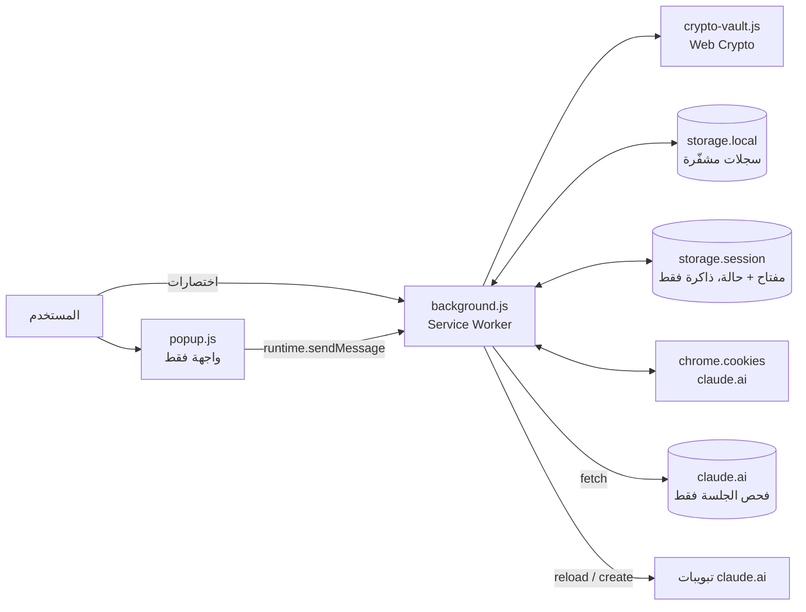
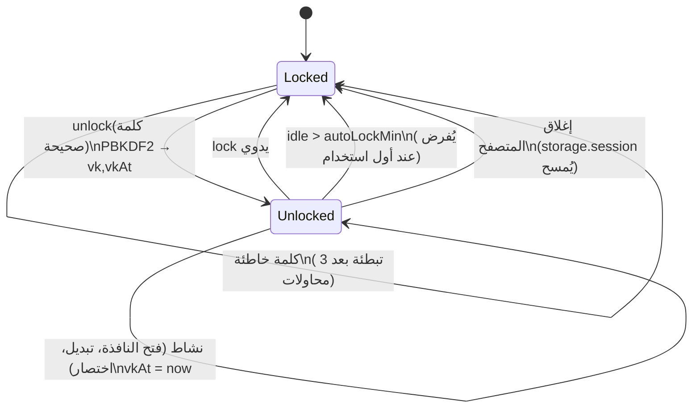
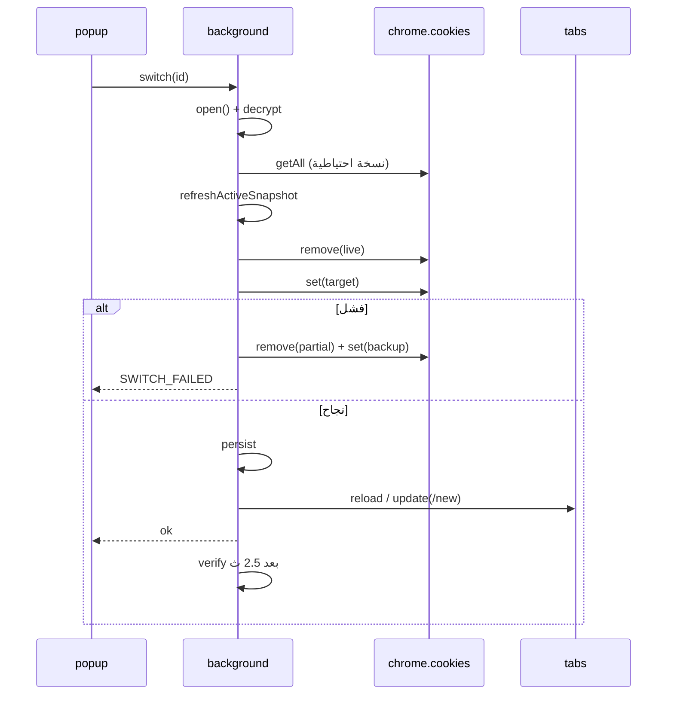
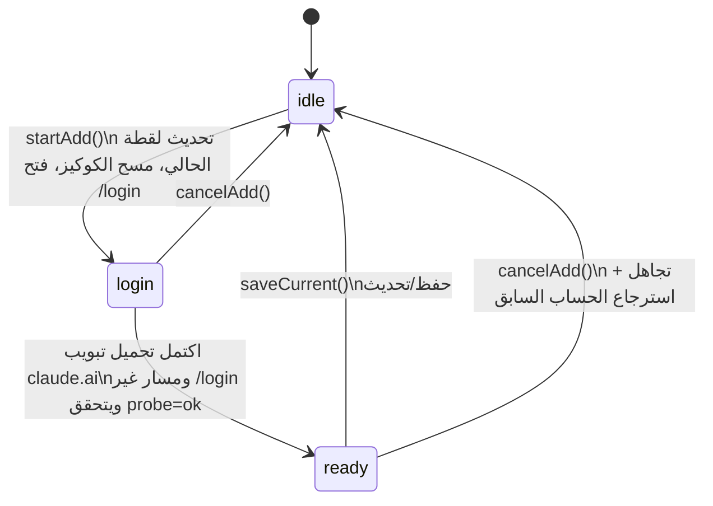
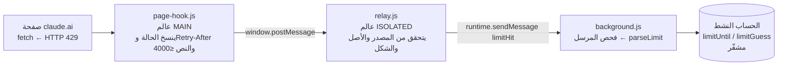

# Hopper — مبدّل حسابات claude.ai (غير رسمي)
## وثيقة هندسية وأكاديمية — الإصدار 1.4.1

> **إخلاء مسؤولية:** مشروع غير رسمي، لا علاقة له بشركة Anthropic ولا ترعاه أو تعتمده. يُذكر اسم claude.ai لوصف الموقع الذي تعمل عليه الإضافة فقط. يُستخدم مع الحسابات التي يملكها المستخدم حصرًا، ولا يجوز استخدامه لمشاركة الحسابات أو لتجاوز حدود الاستخدام.
>
> **حالة التحقق:** لم تخضع الإضافة لمراجعة أمنية مستقلة. التحليل الوارد أدناه تحليل المطوّر نفسه، وليس إثباتًا رسميًا أو شهادة أمنية.

---

## فهرس المحتويات

1. [الملخص](#1-الملخص-abstract)
2. [المقدمة وتحديد المشكلة](#2-المقدمة-وتحديد-المشكلة)
3. [الأهداف وغير الأهداف](#3-الأهداف-وغير-الأهداف)
4. [الخلفية التقنية](#4-الخلفية-التقنية)
5. [المعمارية](#5-المعمارية)
6. [نموذج البيانات](#6-نموذج-البيانات)
7. [التصميم التشفيري](#7-التصميم-التشفيري)
8. [الخوارزميات](#8-الخوارزميات)
9. [نموذج التهديدات والتحليل الأمني](#9-نموذج-التهديدات-والتحليل-الأمني)
10. [الخصوصية وتقليل الصلاحيات](#10-الخصوصية-وتقليل-الصلاحيات)
11. [معالجة الأخطاء](#11-معالجة-الأخطاء)
12. [الواجهة والتدويل وسهولة الوصول](#12-الواجهة-والتدويل-وسهولة-الوصول)
13. [التحقق والاختبار](#13-التحقق-والاختبار)
14. [القيود والعمل المستقبلي](#14-القيود-والعمل-المستقبلي)
15. [الجوانب القانونية والامتثال](#15-الجوانب-القانونية-والامتثال)
16. [بنية المستودع والتثبيت والتطوير](#16-بنية-المستودع-والتثبيت-والتطوير)
17. [المراجع](#17-المراجع)

---

## 1. الملخص (Abstract)

تعرض هذه الوثيقة تصميم Hopper، وهي إضافة لمتصفحات Chromium (Chrome وEdge) بنظام Manifest V3 تتيح للمستخدم التبديل بين عدة حسابات يملكها على claude.ai بنقرة واحدة دون تسجيل خروج ودخول. تقوم الفكرة على التقاط **لقطة (snapshot)** من كوكيز الجلسة لكل حساب، وتخزينها **مشفّرة** محليًا، ثم استبدال كوكيز المتصفح الحية بلقطة الحساب المطلوب وإعادة تحميل التبويبات.

أبرز الخصائص الهندسية:

- لا اعتماد على أي مكتبة خارجية أو خطوة بناء (Vanilla JavaScript، وحدات ES).
- تشفير AES-256-GCM لكل من الكوكيز وبيانات تعريف الحسابات (الاسم والبريد واللون)، بمفتاح مشتق من كلمة مرور رئيسية إلزامية عبر PBKDF2-HMAC-SHA256 بـ 600 ألف تكرار، مع ربط كل سجل بمعرّف حسابه عبر AAD.
- قفل تلقائي بنافذة خمول منزلقة (sliding idle window) تقلل تكرار طلب كلمة المرور دون ترك المفتاح مكشوفًا إلى أجل غير مسمّى.
- تبديل ذو **استرجاع (rollback)** عند الفشل، ومنع تكرار حفظ الحساب نفسه، واكتشاف انتهاء الجلسة.
- أقل صلاحيات ممكنة: `cookies` و`storage` وإذن المضيف `https://claude.ai/*` فقط، دون `tabs` ودون `<all_urls>` ودون شيفرة بعيدة.
- لا شبكة إلا إلى `claude.ai` نفسه، ولا تحليلات ولا تتبّع ولا إعلانات.

---

## 2. المقدمة وتحديد المشكلة

يملك كثير من المستخدمين أكثر من حساب (شخصي وعمل وفريق). التبديل الاعتيادي يتطلب تسجيل الخروج ثم الدخول، وقد يشمل تحقّقًا ثنائيًا أو رابط بريد، وهذا بطيء ومتكرر. البدائل المعتادة:

| البديل | الميزة | العيب |
|---|---|---|
| ملفات Chrome الشخصية (Profiles) | عزل كامل، لا تخزّن إضافة أي كوكيز | تبديل أثقل (نافذة/ملف منفصل)، استهلاك موارد أكبر |
| نوافذ التصفح الخفي | عزل مؤقت | تُفقد الجلسة عند الإغلاق |
| حاويات (Containers) | عزل ممتاز | غير متاحة في Chromium |
| **تبديل الكوكيز (هذا المشروع)** | سرعة وراحة، ضمن ملف واحد | يخزّن أسرارًا بحساسية كلمات المرور، ويحتاج حماية قوية |

المشكلة الهندسية المحورية: **كيف نحتفظ بجلسات متعددة قابلة لإعادة الاستخدام في إضافة متصفح دون أن نُنشئ مخزنًا ضعيف الحماية لأسرار عالية القيمة؟** كوكي الجلسة يعمل كبديل عن بيانات الدخول بعد مصادقتها، فمن يحصل عليه قد يتجاوز كلمة المرور والتحقق الثنائي ما دامت الجلسة صالحة. لذلك تتركز الجهود في التشفير وإدارة المفتاح ودورة حياته.

---

## 3. الأهداف وغير الأهداف

### 3.1 الأهداف

| # | الهدف |
|---|---|
| G1 | تبديل بين حسابات المستخدم بنقرة واحدة أو اختصار لوحة مفاتيح |
| G2 | سرّية البيانات المخزنة (confidentiality at rest) ضد قراءة ملفات الملف الشخصي |
| G3 | سلامة السجلات وعدم قابليتها للتبديل بين الحسابات (integrity) |
| G4 | عدم فقدان الجلسة الحالية عند فشل التبديل (rollback) |
| G5 | أقل صلاحيات وأقل سطح هجوم |
| G6 | خصوصية: لا إرسال بيانات خارج الجهاز |
| G7 | دعم العربية (RTL) والإنجليزية، ووضع فاتح/داكن |
| G8 | تجربة لا تزعج: طلب كلمة المرور مرة عند تشغيل المتصفح وفق مهلة الخمول |

### 3.2 غير الأهداف (Non-goals)

- **حماية الحساب النشط حاليًا** من برمجية خبيثة تعمل بصلاحيات المستخدم: هذه جلسة متصفح عادية خارج سيطرة أي إضافة.
- مشاركة الحسابات بين مستخدمين، أو تجاوز حدود الاستخدام، أو أي أتمتة تخالف شروط الخدمة.
- دعم التصفح الخفي أو مواقع غير claude.ai.
- مزامنة البيانات بين الأجهزة (متعمّد: `chrome.storage.sync` غير مستخدم إطلاقًا).
- استرجاع كلمة المرور الرئيسية المنسيّة (لا توجد آلية استرجاع بالتصميم).

---

## 4. الخلفية التقنية

### 4.1 الجلسات المبنية على الكوكيز

تحتفظ مواقع الويب عادةً بحالة المصادقة في كوكيز (انظر RFC 6265). أهم الخصائص التي تؤثر على التصميم:

- **`HttpOnly`**: لا تقرأه شيفرات الصفحة، لكن واجهة `chrome.cookies` في الإضافة تقرؤه (بإذن المضيف).
- **`Secure`**: يُرسل عبر HTTPS فقط.
- **`SameSite`**: يتحكم بإرسال الكوكي في الطلبات العابرة للمواقع (`lax` / `strict` / `no_restriction`).
- **`hostOnly`**: كوكي بلا سمة Domain يخص المضيف نفسه فقط. عند إعادة إنشائه **يجب عدم تمرير `domain`** وإلا تحوّل إلى كوكي نطاق.
- **البادئات `__Host-` و`__Secure-`**: تفرض قيودًا (مسار `/`، وSecure، وغياب Domain لـ `__Host-`).
- **انتهاء الصلاحية**: كوكي دائم (له `expirationDate`) أو كوكي جلسة (ينتهي بإغلاق المتصفح).

> لذلك لا تفترض الإضافة أسماء كوكيز بعينها عند الحفظ: تُلتقط **كل** كوكيز المضيف `claude.ai` بخصائصها الكاملة.

### 4.2 Manifest V3 وخدمة العمل (Service Worker)

- الخلفية خدمة عمل **غير دائمة**: تُنهى بعد خمول وتُعاد عند وصول حدث. لذلك **لا تُعتمد متغيرات الذاكرة** لحمل الحالة؛ تُحفظ الحالة في `chrome.storage`.
- `chrome.storage.session` تخزين **في الذاكرة فقط**، يُمسح عند إغلاق المتصفح، وبصلاحية وصول افتراضية للسياقات الموثوقة (صفحات الإضافة) دون سكربتات المحتوى. تستفيد منه الإضافة لحمل المفتاح المفتوح وحالة تدفق الإضافة ومحاولات الفتح الخاطئة.
- سياسة أمان المحتوى (CSP) للإضافة: `script-src 'self'; object-src 'self'; base-uri 'none'`، فلا شيفرة مضمّنة ولا بعيدة.

---

## 5. المعمارية

### 5.1 المكوّنات

| الملف | الدور |
|---|---|
| `manifest.json` | الصلاحيات، الاختصارات، CSP، الأيقونات، اللغة الافتراضية |
| `background.js` | خدمة العمل: الكوكيز، التخزين، التشفير، التبديل، التدفقات، الشارة، الاختصارات |
| `crypto-vault.js` | عمليات Web Crypto (اشتقاق المفتاح، تشفير/فك AES-GCM، SHA-256، مفتاح الجهاز القديم) |
| `time-utils.js` | دوال نقية للمنتقي الشبيه بالمنبّه (ساعات+دقائق، أقرب وقت من اليوم، أجزاء المدة) |
| `limit-parser.js` | دوال نقية: تحويل استجابة 429 إلى «هل هو حد؟ ومتى يُعاد؟»؛ وعرض بنيوي للنص للتشخيص |
| `content/page-hook.js`، `content/relay.js` | سكربتا محتوى على claude.ai يبلّغان عن أخطاء الحد HTTP 429 (عالم الصفحة + وسيط معزول) |
| `popup.html/css/js` | واجهة المستخدم؛ لا تحمل أسرارًا، ترسل رسائل إلى الخلفية فقط |
| `_locales/{en,ar}` | 83 مفتاح نص لكل لغة (`chrome.i18n`) |
| `tests/background.test.mjs` | اختبارات منطق الخلفية بواجهات متصفح مُحاكاة |

### 5.2 مخطط المكوّنات وتدفق البيانات



### 5.3 قناة الرسائل

الواجهة تتحدث مع الخلفية برسائل `{type, ...payload}` وتستلم `{ok, data}` أو `{ok:false, error:{code}}`. تتحقق الخلفية من `sender.id === chrome.runtime.id` وتتجاهل أي مصدر آخر. أنواع الرسائل:

`status`، `setup`، `unlock`، `lock`، `setPassword`، `setAutoLock`، `setRemember`، `setLimit`، `limitHit` (لسكربت المحتوى فقط)، `limitDiag`، `deleteAll`، `detect`، `saveCurrent`، `startAdd`، `cancelAdd`، `switch`، `refreshActive`، `rename`، `setColor`، `remove`.

### 5.4 نموذج التزامن

العمليات المُغيِّرة للحالة تمر عبر **طابور تسلسلي (serial queue)** قائم على سلسلة وعود (Promise chain):

```js
let queue = Promise.resolve();
function serial(fn) { const run = queue.then(fn); queue = run.catch(() => {}); return run; }
```

- الغاية: منع تداخل تبديل الكوكيز مع كتابات التخزين أو مع عملية تبديل أخرى (race conditions).
- العملية `status` للقراءة فقط وتتجاوز الطابور.
- الطابور **غير قابل لإعادة الدخول (non re-entrant)**؛ لذا تستدعي العمليات الداخلية بعضها مباشرة ولا تستدعي `serial` ثانية (وإلا حدث deadlock).
- ملاحظة: مستمع `tabs.onUpdated` يكتب حالة `pending` في `storage.session` خارج الطابور؛ التعارض هنا محدود لأنه يكتب مفتاحًا واحدًا لا تعدّله العمليات الأخرى إلا عبر استبداله الكامل.

---

## 6. نموذج البيانات

### 6.1 `chrome.storage.local["state"]` (دائم)

```jsonc
{
  "v": 2,
  "setupDone": true,
  "vault": { "mode": "password", "salt": "<b64 16B>", "iter": 600000,
             "verifier": { "v": 2, "iv": "<b64 12B>", "ct": "<b64>" } },
  "settings": { "autoLockMin": 240, "remember": false },          // بالدقائق: 15 | 60 | 240 | 1440 | 4320 | 10080 | 0 (0 = حتى إغلاق المتصفح)
  "activeId": "<uuid> | null",
  "accounts": [
    { "id": "<uuid>",
      "meta": { "v": 2, "iv": "...", "ct": "..." },   // مشفّر: name,color,email,sfp,createdAt,lastUsed,status,limitUntil?
      "blob": { "v": 2, "iv": "...", "ct": "..." } }  // مشفّر: مصفوفة الكوكيز
  ]
}
```

الحقول غير المشفّرة: `v` و`setupDone` و`vault.salt/iter/verifier` (الأخير نص مشفّر) و`settings` و`activeId` (معرّف عشوائي لا يحمل معنى) و`id` لكل حساب. لا يُخزَّن اسم ولا بريد ولا قيمة كوكي بنص صريح.

### 6.1ب المفتاح الاختياري `chrome.storage.local["remember"]`

يوجد فقط أثناء تفعيل «البقاء مفتوحًا بعد إعادة تشغيل المتصفح»: `{ wrapped, lastActive }` حيث `wrapped` هو مفتاح الفتح الخام مشفّرًا (AES-GCM وAAD = `remember`) بـ**مفتاح الجهاز غير القابل للتصدير** المحفوظ في IndexedDB، و`lastActive` وقت آخر استخدام. يُحفظ تحت مفتاح مستقل (لا داخل `state`) حتى لا تتسابق تحديثات النشاط المتكررة مع كتابات الحالة.

### 6.2 `chrome.storage.session` (ذاكرة فقط)

| المفتاح | المحتوى |
|---|---|
| `vk` | المفتاح المفتوح (raw AES-256، Base64) |
| `vkAt` | وقت آخر نشاط (لمؤقّت الخمول) |
| `pending` | حالة تدفق الإضافة `{phase, tabId, previousId, identity}` |
| `unlockFail` | `{n, until}` لتبطئة المحاولات الخاطئة |

### 6.3 عنصر الكوكي المسلسَل

يُحفظ لكل كوكي: `name, value, domain, hostOnly, path, secure, httpOnly, sameSite, session` و`expirationDate` (إن لم يكن كوكي جلسة). لا يُحفظ `storeId` (يُستخدم المخزن الافتراضي) ولا مفتاح التقسيم (partitionKey).

### 6.4 الحالة المُرطَّبة (Hydrated) في الذاكرة

عند أي عملية تُفك بيانات التعريف (`meta`) لكل الحسابات إلى كائنات عادية `{id,name,color,...,blob}`، وتُعاد كتابتها عبر `persist()` التي تعيد تشفير كل `meta` بـ IV جديد. الحد الأقصى للحسابات 20، فالكلفة (حتى 20 عملية فك AES-GCM لكل عملية) مهملة عمليًا.

---

## 7. التصميم التشفيري

### 7.1 المعاملات

| العنصر | الاختيار |
|---|---|
| اشتقاق المفتاح | PBKDF2-HMAC-SHA256، **600,000** تكرار، ملح عشوائي 16 بايت |
| التشفير | AES-256-GCM عبر Web Crypto API |
| IV | 96 بت عشوائي لكل عملية تشفير (`crypto.getRandomValues`) |
| AAD | يربط السجل بمالكه: `<id>:cookies` و`<id>:meta` و`verifier` |
| التحقق من كلمة المرور | **verifier**: تشفير `{ok:true}` بالمفتاح المشتق؛ نجاح فكّه يعني صحة الكلمة |
| الاحتفاظ بكلمة المرور | لا تُخزَّن إطلاقًا؛ يُخزَّن الملح والعدّاد والـ verifier فقط |

**المبررات.** عدد التكرارات يطابق توصية OWASP الحالية لـ PBKDF2-HMAC-SHA256. أما IV العشوائي 96 بت مع GCM فمقبول ضمن حدود NIST SP 800-38D ما دام عدد عمليات التشفير بالمفتاح الواحد صغيرًا جدًا (هنا عشرات إلى مئات). ويُستخدم المفتاح نفسه لسجلات متعددة، والفصل بين السجلات يتحقق عبر AAD لا عبر مفاتيح منفصلة.

### 7.2 ربط السجلات بالمالك (AAD)

بدون AAD، يستطيع من يحرّر التخزين تبديل `blob` الحساب A بـ `blob` الحساب B فيُفك بنجاح ويُنسب إلى الحساب الخطأ. باستخدام AAD = `<id>:cookies` يفشل فك التشفير عند التبديل (فيُرفض بكود `CORRUPT`). تغطي الاختبارات هذه الحالة.

> **حدّ مهم:** AAD لا يمنع **هجوم الاستبدال بإصدار قديم صالح (rollback of the whole state)**، لأن لا عدّاد رتيب (monotonic counter) في التصميم. من يستبدل ملف الحالة بنسخة قديمة صالحة لن يُكتشف.

### 7.3 دورة حياة المفتاح وآلة حالات القفل



**سلوكيات مهمة:**

- **نافذة خمول منزلقة (sliding):** كل استخدام فعلي (`status` عند فتح النافذة، `switch`، `saveCurrent`، الاختصارات…) يجدّد `vkAt`. عمليات خلفية صامتة (التحقق بعد التبديل `opVerify` وتحديث شارة الأدوات) تُستدعى بـ `touch:false` فلا تمدّد الجلسة بنفسها.
- **فرض كسول (lazy enforcement):** لا مؤقّت في الخلفية (تجنّبًا لإضافة صلاحية `alarms`). عند أول استخدام بعد انقضاء المهلة يُحذف المفتاح ويُرجع `LOCKED`. أي أن المفتاح قد يبقى في ذاكرة المتصفح (وليس على القرص) إلى حين أول وصول بعد المهلة. هذه مفاضلة واعية بين تقليل الصلاحيات وصرامة التوقيت.
- **خيارات المهلة:** 15 دقيقة، ساعة، 4 ساعات (الافتراضي)، يوم، 3 أيام، أسبوع، أو «حتى إغلاق المتصفح» (القيمة 0: لا قفل بسبب الخمول). كل المهل **منزلقة** فالاستخدام المنتظم يُبقي الإضافة مفتوحة. **وهي تسري ما دامت عملية المتصفح قائمة فقط:** المفتاح في `storage.session` الذي يُمسح عند الإغلاق الكامل للمتصفح، فإعادة التشغيل الكاملة تتطلب كلمة المرور دائمًا. كما أن المهل الطويلة تُبقي المفتاح في الذاكرة مدة أطول، فيتسع التعرّض المذكور في القسم 9.4.
- **التبطئة:** بعد 3 إخفاقات: `delay = min(2^(n-3) ثانية, 60 ثانية)`، وتُصفّر عند النجاح. العدّاد في `storage.session`، فيُصفَّر عند إعادة تشغيل المتصفح. الغرض حماية من شخص أمام متصفح مفتوح، أما الحماية من التخمين خارج الاتصال (offline) فمصدرها كلفة PBKDF2 وقوة الكلمة.
- **تصدير المفتاح:** المفتاح المشتق قابل للتصدير (extractable=true) لكي يُحفظ بصيغة raw في `storage.session`. هذا قرار تصميمي مقصود لأن خدمة العمل تُنهى وتُعاد ولا يمكن إبقاء `CryptoKey` حيًا بين الدورات.

#### الاستمرار بعد إعادة التشغيل (خيار «remember»)

لأن `storage.session` يُمسح عند إغلاق المتصفح، لا تكفي مهل الخمول وحدها لإبقاء الإضافة مفتوحة بعد إعادة تشغيل كاملة. لذلك يوجد إعداد **اختياري** (معطّل افتراضيًا وبنافذة تأكيد) يحفظ نسخة مغلّفة من مفتاح الفتح في `storage.local`:

- **الاستعادة:** إذا غاب مفتاح الجلسة وكان `remember` مفعّلًا، تفك `getKey` النسخة المخزنة بمفتاح الجهاز وتعيد ملء `storage.session`، لكن **فقط** إذا كان `now - lastActive` ضمن مهلة الخمول. وإلا تُحذف النسخة ويُرجع `LOCKED`.
- **تعرّض محدود:** المهلة إلزامية. القيمة 0 («حتى إغلاق المتصفح») مرفوضة أثناء التذكّر، والتفعيل يحوّلها إلى أسبوع.
- **المسح:** القفل اليدوي، أو انتهاء الخمول، أو فشل الفك، أو إيقاف الخيار، أو «حذف كل البيانات» يحذف النسخة. وفتح القفل بالكلمة الصحيحة يعيد إنشاءها ما دام الخيار مفعّلًا.
- **الأثر الأمني:** مفتاح الجهاز والمفتاح المغلّف في ملف المتصفح نفسه، فمن ينسخ الملف الشخصي يستطيع فك المفتاح وفتح الحسابات **دون كلمة المرور** حتى تنقضي المهلة. القوة مكافئة لوضع مفتاح الجهاز في 1.0 لكنها محدودة بالزمن واختيارية، ولهذا هو معطّل افتراضيًا.

### 7.4 الوضع القديم وترقية البيانات (Migration)

الإصدار 1.0 أتاح العمل بلا كلمة مرور بمفتاح جهاز **غير قابل للتصدير** مخزَّن في IndexedDB، وبيانات تعريف نصية صريحة. من 1.1.0 كلمة المرور إلزامية. عند اكتشاف `vault.mode !== 'password'`:

1. تعرض الواجهة شاشة «تحديث أمني» وتمنع بقية الإجراءات (`NOT_SETUP`).
2. `opSetPassword` تفك التشفير بمفتاح الجهاز، وتقبل البيانات القديمة (بلا `v:2` وبلا AAD وبيانات تعريف نصية)، ثم تعيد تشفير **كل** شيء بمفتاح كلمة المرور، في **كتابة واحدة** (`persist`)؛ فتبقى البيانات القديمة صالحة إلى أن تنجح الكتابة.
3. تبقى سجلات `v:1` قابلة للقراءة (ثنائية التوافق) وتُرقّى فعليًا عند أول إعادة تشفير.

---

## 8. الخوارزميات

### 8.1 الحفظ (Save)

```
SAVE_CURRENT():
  (S,K) ← open()
  probe ← probeSession()                       // فحص claude.ai
  if probe = anon → NOT_LOGGED_IN
  C ← serialize(liveCookies())                 // كل كوكيز claude.ai
  if C = ∅ → NOT_LOGGED_IN
  sfp ← fingerprint(C)
  m ← findMatch(S, probe.email, sfp)           // منع التكرار
  if m ≠ ⊥ → m.blob ← Enc_K(C; aad=m.id‖":cookies"); m.status ← ok
  else      → أنشئ حسابًا جديدًا (id=UUID، اسم من probe أو «حساب N»، لون غير مستخدم)
  S.active ← id; persist(S,K); pending ← ⊥
```

### 8.2 التبديل (Switch) مع الاسترجاع

```
SWITCH(id):
  (S,K) ← open()                               // فك القفل + فك بيانات التعريف + تجديد المؤقّت
  T ← S.accounts[id];     if T = ⊥  → NOT_FOUND
  if S.active = id → return
  C_T ← Dec_K(T.blob; aad=id‖":cookies")       // فشل → CORRUPT
  if ¬usable(C_T) → T.status ← expired; EXPIRED
  C_0 ← serialize(liveCookies())               // نسخة احتياطية للاسترجاع
  if S.active ≠ ⊥ → refreshActiveSnapshot(S.active, C_0)
  remove(C_0)
  try   apply(C_T)
  catch → remove(live); try apply(C_0); SWITCH_FAILED
  S.active ← id; T.lastUsed ← now; persist(S,K)
  reloadTabs(); schedule verify(id) بعد 2.5 ث
```

**نقاط التصميم:**

1. **تحديث لقطة الحساب الحالي قبل المغادرة:** الخادم قد يدوّر (rotate) رموز الجلسة، فلو لم تُحدَّث اللقطة لعادت قديمة.
2. **حماية من الكتابة الخاطئة:** `refreshActiveSnapshot` تتخطى التحديث إذا كانت الجلسة الحية ميتة (`anon`) أو بريدها يختلف عن بريد الحساب النشط (المستخدم بدّل يدويًا).
3. **الذرّية:** لا ذرّية حقيقية في واجهة `cookies`. الاسترجاع جهد أفضل (best effort): إن فشل الاسترجاع نفسه تُبتلع الاستثناءات ويبقى المستخدم بجلسة غير مكتملة. كما أن تحديث اللقطة يُحفَظ في الذاكرة فقط ولا يُثبَّت إلا عند نجاح الإتمام.
4. **تطبيق الكوكي:** تُتخطى الكوكيز المنتهية؛ ويُمرَّر `domain` فقط لكوكيز النطاق (`hostOnly=false`)؛ وتُشتق الـ URL من المضيف والمسار.
5. **إعادة التحميل:** كل تبويبات claude.ai تُحدَّث (الكوكيز مشتركة في الملف). وإذا كان المسار `/chat/...` أو `/project(s)/...` يُنقل التبويب إلى `/new` لأن محادثة حساب آخر ستعطي 404. وإذا لم يوجد تبويب يُفتح واحد جديد.



### 8.3 تدفق إضافة حساب



- حالة `pending` تُحفظ في `storage.session`. عند إكمال تحميل **أي** تبويب claude.ai (لا تبويب بعينه، لدعم روابط البريد وتدفقات OAuth التي تفتح تبويبًا آخر) وكان المسار لا يبدأ بـ `/login` يُنفَّذ `probeSession`؛ فإن نجح صارت الحالة `ready` وتظهر شارة خضراء `+`.
- يُعاد استخدام التبويب الحالي إن كان على claude.ai، وإلا يُفتح تبويب جديد (لا يُغيَّر موقع المستخدم الآخر).
- عند الإلغاء يُعاد الحساب السابق عبر `switch`.
- **الكشف عند فتح النافذة (`detect`):** إن وُجدت جلسة حية تطابق حسابًا محفوظًا تُعتمد حسابًا نشطًا وتُحدَّث لقطته؛ وإن لم تطابق أي حساب يظهر «حفظ هذا الحساب؟».

#### إعادة تسجيل الدخول بنقرة لحساب موجود

`startAdd({ reloginId })` يشغّل تدفق الإضافة نفسه لكنه يتذكّر أي حساب يجري تحديثه (`pending.reloginId`). عند اكتمال تحميل تبويب claude.ai ونجاح الفحص، تعمل `opAutoRelogin` تلقائيًا:

- إذا طابقت الهوية الحساب المستهدف (البريد نفسه، أو غاب البريد عن أحد الطرفين) تحلّ الكوكيز الحية محل لقطة الحساب، وتصبح حالته `ok` ويصير النشط، وينتهي التدفق دون أي سؤال إضافي. نقرة المستخدم الصريحة على «تسجيل الدخول مجددًا» تُعدّ موافقة.
- إذا دخل **حساب مختلف** فلا يُكتب شيء، ويظهر بدلًا من ذلك البنر المعتاد «حفظ هذا الحساب؟/تحديث الحساب المحفوظ؟».
- إذا انقفل المخزن في الأثناء يبقى التدفق في `ready` ويعالجه البنر بعد فتح القفل.
- المسار نفسه يُستخدم عندما يجد «تحديث الجلسة» أن الجلسة الحية ميتة (`NOT_LOGGED_IN`): تبدأ الواجهة تدفق إعادة الدخول مباشرة.

### 8.4 كشف الهوية ومنع التكرار

- `probeSession()` يطلب `/api/account` ثم `/api/bootstrap` من `claude.ai` بالكوكيز الحالية (بإذن المضيف). **هاتان نقطتان غير موثّقتين رسميًا وقد تتغيران.** النتيجة: `ok` (مع بريد/اسم إن وُجد) أو `anon` (401، أو 403 بمحتوى JSON) أو `unknown` (فشل شبكة/محتوى غير متوقع، مثل صفحة تحدٍّ من Cloudflare).
- التعرّف على التكرار: تطابق البريد (غير حساس لحالة الأحرف) **أو** تطابق **بصمة الجلسة (sfp)**.
- `sfp` = أول 32 خانة سداسية من `SHA-256("name=value")` لكوكي HttpOnly الأشبه بالجلسة (اسمه يطابق `/session/i`، وإلا الأبعد انتهاءً). لا تُخزَّن القيمة الخام.
- **قيد:** إذا دوّر الخادم الرمز تتغير `sfp`، فتضعف قدرة الكشف عند غياب البريد؛ لذا البريد هو المعرّف الأساس.

### 8.5 حالة «انتهاء الجلسة»

تُعلَّم الجلسة منتهية (`expired`) في حالتين: (1) كل كوكيز اللقطة منتهية بالتوقيت، (2) بعد التبديل بنحو 2.5 ثانية يرجع الفحص `anon`. وتتيح الواجهة «تسجيل الدخول مجددًا» (يُشغّل تدفق الإضافة). الحسابات المنتهية تُتخطى في التبديل بالاختصارات.

### 8.6 اكتشاف الحد وتذكير إعادة التعيين

يمكن أن يحمل الحساب `limitUntil` (و`limitGuess`) داخل `meta` المشفّر. تعرضه الواجهة شارةً على الشريحة، وتلميحًا أصليًا (`title`) عند التمرير («يُعاد تعيين الحد خلال ساعتين (≈ 6:30 م)»)، وحبّة في بطاقة التفاصيل. وهو معلوماتي بحت: لا يغيّر التبديل ولا الاختصارات ولا أي حد.

**مسار الاكتشاف التلقائي**



- يغلّف `page-hook.js` الدالة `window.fetch` ويُرجع **الوعد الأصلي دون مساس**؛ وفي فرع جانبي يستنسخ الاستجابة فقط عندما تكون الحالة 429 والطلب من الأصل نفسه إلى مسار `/api/`. لا يغيّر أي طلب أو استجابة.
- يعيد `relay.js` التحقق من كل شيء (النافذة والأصل والإصدار والشكل) ويحدّ الأحجام لأن سياق الصفحة غير موثوق.
- تقبل `background.js` الرسالة `limitHit` **فقط** من مرسل سكربت محتوى على claude.ai، وتقبل بقية الرسائل **فقط** من صفحات الإضافة نفسها (بفحص عنوان المرسل).
- تقرأ `parseLimit` (دالة نقية في `limit-parser.js`) ترويسة `Retry-After` وتفحص نص JSON، بما فيه JSON المضمّن داخل حقول نصية، بحثًا عن مفاتيح وقت الإعادة (مطلقة: `resetsAt` و`reset_time`…؛ نسبية: `retry_after` و`resets_in`…). وتفهم الثواني/الملّي ثانية من العصر، وتواريخ ISO، والنصوص الرقمية.
- **قواعد الاختيار:** لا تُحتسب إلا الأوقات المستقبلية خلال 8 أيام؛ وعند وجود عدة نوافذ (مثل نافذة قصيرة وسقف أسبوعي) يُؤخذ **أقرب** وقت مستقبلي، ويصحّحه الخطأ 429 التالي إن لم يكن هو الحد الفعلي؛ وتُعدّ الانتظارات الأقل من دقيقتين تبطئة عادية وتُتجاهل.
- **وقت إعادة غير معروف:** إذا لم يوجد وقت لكن النص يقول بوضوح إن حد الاستخدام قد بُلغ، يُعلَّم الحساب `limitGuess` لمدة ساعة (تتجدد بالخطأ 429 التالي). والتخمين لا يستبدل وقتًا معروفًا أبدًا.
- **المخزن مقفل:** يكفي `activeId` غير المشفّر لنسب الحدث، فيُحفظ في `storage.session` (`pendingLimits`) ويُطبَّق عبر `openState` عند فتح المخزن.
- **الهدف:** دائمًا الحساب النشط حاليًا (الكوكيز مشتركة، فجلسة التبويب هي جلسة الحساب النشط).
- **مخاطرة الصيغة:** نص 429 في claude.ai ليس واجهة موثّقة. المحلّل متسامح ومُختبَر على أشكال محتملة فقط (القسم 13.2). ويحتفظ `lastLimit` في `storage.session` بسجل بنيوي (مفاتيح وأنواع وقيم قصيرة شبيهة بالتعدادات، بلا نص حر) يمكن للمستخدم نسخه بزر «نسخ تشخيص الحد» لضبط المحلّل.

**الإدخال اليدوي** منتقٍ شبيه بالمنبّه بثلاثة أوضاع: *بعد* (ساعات ودقائق من الآن)، و*عند* (وقت من اليوم؛ أقرب موعد قادم، وغدًا إن فات)، و*تاريخ* (تاريخ ووقت محدّدان للسقف الأسبوعي)، مع اختصارات 1/3/5 ساعات. وتعرض معاينة حيّة موعد الإعادة الناتج قبل الحفظ. والحساب في `time-utils.js` (دوال نقية مُختبَرة). ويجب أن يكون الوقت في المستقبل وخلال 8 أيام وإلا `BAD_TIME`، ويتغلّب على أي تخمين. وعند اكتشاف حد دون وقت إعادة تفتح النافذة هذا المنتقي تلقائيًا. والتذكيرات المنتهية تُخفيها `publicAccount` فلا حاجة لمؤقّت ولا لصلاحية `alarms`.

---

## 9. نموذج التهديدات والتحليل الأمني

### 9.1 الأصول (Assets)

| الأصل | الحساسية |
|---|---|
| كوكيز الجلسة المحفوظة | عالية جدًا (تعادل بيانات دخول) |
| بيانات التعريف (اسم/بريد) | متوسطة (خصوصية) |
| المفتاح المفتوح في الذاكرة | عالية جدًا (مفتاح فك كل شيء) |
| كلمة المرور الرئيسية | عالية جدًا |
| الكوكيز الحية للحساب النشط | عالية (خارج نطاق الحماية) |

### 9.2 الخصوم والتخفيفات

| الخصم | قدرته | التخفيف | بقاء الخطر |
|---|---|---|---|
| **A1** شخص يقرأ ملفات الملف الشخصي (جهاز مسروق/نسخة احتياطية) | قراءة `storage.local` | تشفير AES-GCM بمفتاح PBKDF2 | يعتمد على قوة كلمة المرور؛ **وينتفي أثناء تفعيل «remember» قبل انقضاء مهلة الخمول** |
| **A2** برمجية خبيثة بصلاحيات مستخدم النظام | تنفيذ شيفرة، قراءة ذاكرة، سرقة كوكيز المتصفح الحية | لا تخفيف كامل | **خارج النطاق**: تستطيع قراءة الكوكيز الحية ومفتاح الجلسة من الذاكرة |
| **A3** إضافة خبيثة أخرى | وصول إلى `cookies` إن كانت لديها الصلاحية | عزل الإضافات؛ لا سكربتات محتوى؛ `storage.session` للسياقات الموثوقة | إضافة بصلاحية `cookies` على claude.ai تستطيع قراءة الجلسة الحية أصلًا |
| **A4** مهاجم شبكة | اعتراض الاتصال | لا طلبات إلا لـ claude.ai عبر HTTPS | لا شيء إضافي |
| **A5** شخص أمام متصفح مفتوح | استخدام الواجهة | قفل تلقائي، زر «قفل»، تبطئة المحاولات | قبل انقضاء المهلة يبقى مفتوحًا |
| **A6** سلسلة التوريد (تحديث خبيث/حساب مطوّر مخترق) | شحن شيفرة ضارة لكل المستخدمين | بلا مكتبات خارجية، شيفرة صغيرة قابلة للمراجعة، توصية بـ 2FA لحساب المطوّر، نشر مفتوح المصدر | **الخطر الأعلى أثرًا**، تخفيفه إجرائي لا تقني |
| **A7** حقن (XSS) في النافذة | تنفيذ سكربت بسياق الإضافة | بناء DOM بـ `textContent` بلا `innerHTML`، وCSP صارمة | منخفض |
| **A8** اكتشاف/تقييد من الخادم | إنهاء جلسات أو طلب إعادة تحقق | لا يمكن تخفيفه تقنيًا هنا | مجهول؛ راجع شروط الخدمة |
| **A9** تلاعب بملف الحالة | تبديل سجلات | GCM + AAD | استبدال بإصدار قديم صالح غير مُكتشف |
| **A10** سكربت في صفحة claude.ai يزوّر رسائل `limitHit` | جعل حساب يبدو محدودًا | تحقق الوسيط وإعادة التحقق في الخلفية وتقييد المرسل؛ لا يتغير إلا حقل التذكير للحساب النشط ولا يمس أي أسرار | شارة «محدود» كاذبة طوال المدة المذكورة |

### 9.3 الخصائص الأمنية المدّعاة

- **سرّية السجلات المخزنة** أثناء القفل (إذا كانت كلمة المرور قوية) ضد A1.
- **سلامة كل سجل وارتباطه بمالكه** (تفشل المعالجة عند التلاعب بمحتوى سجل أو تبديل سجلين).
- **عدم ظهور قيم الكوكيز في السجلات (logs)**: لا يُطبع إلا كود الخطأ.
- **عدم وجود اتصالات خارج claude.ai**.

### 9.4 المخاطر المتبقية المعروفة

1. المفتاح المفتوح موجود في `storage.session` بصيغة raw، وقد يبقى بعد انتهاء المهلة حتى أول وصول (فرض كسول).
2. لا مسح صريح للأسرار من ذاكرة JavaScript (لا يوجد ضمان zeroization في بيئة JS مُدارة).
3. الكوكيز تكون واضحة (plaintext) في الذاكرة أثناء التبديل.
4. لا حماية ضد استبدال ملف الحالة كاملًا بنسخة قديمة صالحة.
5. التبطئة لا تمنع التخمين خارج الاتصال؛ تعتمد الحماية هناك على قوة كلمة المرور.
6. لا استرجاع لكلمة المرور؛ نسيانها يعني حذف البيانات.
7. اعتماد على نقاط غير موثّقة (`/api/account`) لكشف الهوية.
8. عند تفعيل «remember» لا تحمي كلمة المرور من نسخ ملفات الملف الشخصي حتى تنقضي مهلة الخمول (القسم 7.3).

---

## 10. الخصوصية وتقليل الصلاحيات

### 10.1 الصلاحيات

| الصلاحية | سبب الطلب |
|---|---|
| `cookies` | قراءة وحفظ وحذف واستعادة كوكيز جلسات حسابات المستخدم؛ جوهر آلية التبديل |
| `storage` | حفظ اللقطات المشفّرة والإعدادات في `local`، والمفتاح المؤقت في `session` |
| `https://claude.ai/*` | الوصول إلى كوكيز الموقع والاستعلام عن صلاحية الجلسة واسم/بريد الحساب |

**سكربتا المحتوى:** يطابق سكربتان `https://claude.ai/*` (أحدهما في عالم الصفحة والآخر معزول). لا يضيفان صلاحية فوق إذن المضيف المطلوب أصلًا، وشُرحا في القسم 8.6 وأُعلنا في `PRIVACY.md` ونموذج المتجر.

**لا يُطلب:** `tabs` (إذن المضيف يكفي لقراءة `url` لتبويبات claude.ai ولإنشاء/تحديث/إعادة تحميل التبويبات)، ولا `<all_urls>`، ولا `alarms`، ولا `scripting`، ولا شيفرة بعيدة. إزالة `tabs` تحذف أيضًا تحذير «قراءة سجل التصفح» من واجهة التثبيت.

### 10.2 سياسة البيانات

- كل شيء في `chrome.storage.local`، و`chrome.storage.sync` **غير مستخدم** إطلاقًا (والاختبارات تُفجّر خطأً عند أي استدعاء له).
- لا شبكة إلا إلى `claude.ai`. لا تحليلات ولا تتبع ولا إعلانات.
- **حذف كل البيانات** من الإعدادات يمسح `storage.local` و`storage.session` ومفتاح الجهاز القديم (IndexedDB)، ولا يسجّل خروجك من claude.ai.
- التفاصيل الكاملة في `PRIVACY.md`.

---

## 11. معالجة الأخطاء

تُرجع الخلفية **أكوادًا ثابتة** (لا نصوصًا)، وتترجمها الواجهة عبر `chrome.i18n` بمفتاح `err_<CODE>`. يُسجَّل في السجل كود الخطأ فقط لتفادي أي تسرّب لقيم.

| الكود | المعنى |
|---|---|
| `LOCKED` | القفل مفعّل (يدويًا أو بالخمول أو بعد تشغيل المتصفح) |
| `NOT_SETUP` | الإعداد غير مكتمل أو يلزم تعيين كلمة مرور (ترقية) |
| `NOT_FOUND` | حساب غير موجود |
| `EXPIRED` | لقطة الحساب منتهية الصلاحية |
| `SWITCH_FAILED` | فشل ضبط الكوكيز؛ جرى الاسترجاع |
| `NOT_LOGGED_IN` | لا توجد جلسة صالحة على claude.ai |
| `BAD_PASSWORD` | كلمة مرور خاطئة |
| `WEAK_PASSWORD` | أقل من 8 أحرف |
| `PW_MISMATCH` | عدم تطابق حقلَي كلمة المرور (يُكتشف في الواجهة) |
| `MISMATCH` | الحساب الحي يختلف عن الحساب المراد تحديثه |
| `CORRUPT` | تعذّر فك تشفير سجل (تلف أو تلاعب) |
| `TOO_MANY` | محاولات فتح كثيرة؛ انتظر |
| `BAD_TIME` | وقت تذكير الحد في الماضي أو بعد أكثر من 8 أيام |
| `GENERIC` | خطأ عام |

---

## 12. الواجهة والتدويل وسهولة الوصول

- **التخطيط:** نافذة 340×440 بكسل. شريط شرائح أفقي (دائرة بحرف أول ولون؛ حلقة حول النشط؛ نقطة تنبيه للمنتهي) وزر `+` في آخره؛ أسفله بطاقة تفاصيل (الاسم، البريد، آخر استخدام، الحالة، وأزرار: إعادة تسمية، لون، تحديث الجلسة/تسجيل الدخول مجددًا، حذف). النقر على شريحة = تبديل فوري؛ النقر بالزر الأيمن = عرض التفاصيل دون تبديل.
- **التدويل:** `chrome.i18n` بملفَّي `_locales/en` و`_locales/ar` (83 مفتاحًا). اللغة تتبع لغة واجهة المتصفح (لا مبدّل داخل الإضافة). الاتجاه من `@@bidi_dir`.
- **RTL:** الأنماط تعتمد **الخصائص المنطقية (logical properties)** (`margin-inline`, `inset-inline-end`...) فيُعكس التخطيط تلقائيًا.
- **الثيم:** فاتح/داكن تلقائي عبر `prefers-color-scheme`، وتقليل الحركة عبر `prefers-reduced-motion`.
- **الأمان في العرض:** بناء DOM يدويًا و`textContent` فقط؛ لا `innerHTML` في أي موضع (أسماء الحسابات بيانات مستخدم).
- **سهولة الوصول:** عناصر `button` حقيقية بـ `aria-label` و`aria-pressed`، ومؤشر تركيز ظاهر، وإشعارات `aria-live` للرسائل.
- **الاختصارات:** `Alt+Shift+A` (فتح)، `Alt+Shift+→` و`Alt+Shift+←` (تنقّل). تُغيَّر من `chrome://extensions/shortcuts`. شارة الأدوات تُظهر حرف الحساب لحظيًا بعد التبديل، و`!` أحمر عند الفشل/القفل، و`+` أخضر عند الجاهزية للحفظ.

---

## 13. التحقق والاختبار

### 13.1 الاختبارات الآلية

`tests/background.test.mjs` يشغّل `background.js` الحقيقي مع **محاكاة** لواجهات `chrome.storage` و`chrome.cookies` و`chrome.tabs` و`fetch` و`IndexedDB`. يتحقق من **42 فحصًا**:

| # | الفحص |
|---|---|
| 1 | كلمة المرور إلزامية (رفض الضعيفة والفارغة) |
| 2 | حفظ حساب |
| 3 | الأسماء والبريد والكوكيز **مشفّرة** في التخزين (لا نص صريح) |
| 4 | تدفق إضافة الحساب وحالة `pending` |
| 5 | التبديل يستعيد الكوكيز بخصائصها (بما فيها `hostOnly`) |
| 6 | فشل التبديل يُرجع الكوكيز السابقة |
| 7 | عدم حفظ الحساب نفسه مرتين |
| 8 | إعادة التسمية تعمل وتبقى مشفّرة |
| 9 | القفل التلقائي عند الخمول |
| 10 | التبطئة بعد 3 محاولات خاطئة |
| 11 | الفتح بعد الانتظار |
| 12 | النشاط يجدّد المؤقّت (منزلق) |
| 13 | «حتى إغلاق المتصفح» لا يقفل بالخمول |
| 14 | تبديل سجلين داخل التخزين يُكتشف (AAD) |
| 15 | تغيير كلمة المرور يعيد التشفير ويبقي الحسابات صالحة |
| 16 | ترقية بيانات 1.0 (مفتاح جهاز + بيانات نصية + بلا AAD) |
| 17 | المهل الطويلة (يوم، 3 أيام، أسبوع) تقفل بعد حدّها فقط، وترفض القيم غير الصالحة |
| 18 | حذف كل البيانات |
| 19 | إعادة الدخول بنقرة تحدّث الحساب نفسه تلقائيًا |
| 20 | الدخول بحساب مختلف أثناء إعادة الدخول لا يُحفظ تلقائيًا |
| 21 | المفتاح المتذكَّر يبقى بعد محاكاة إعادة تشغيل المتصفح ولا يُخزَّن نصًا صريحًا |
| 22 | المفتاح المتذكَّر ينتهي بعد مهلة الخمول حتى عبر إعادة التشغيل |
| 23 | القفل اليدوي يمسح المفتاح المتذكَّر |
| 24 | «حتى إغلاق المتصفح» مرفوض أثناء التذكّر |
| 25 | إيقاف التذكّر يعيد طلب كلمة المرور بعد إعادة التشغيل |
| 26 | تذكير الحد يُحفظ ويُخزَّن مشفّرًا |
| 27 | أوقات التذكير غير الصالحة تُرفض |
| 28 | يمكن مسح تذكير الحد |
| 29 | يختفي التذكير تلقائيًا بعد وقت الإعادة |
| 30 | المحلّل: الترويسة والنص وJSON المضمّن وعدة نوافذ؛ والتبطئة العادية تُتجاهل |
| 31 | الخطأ 429 مع وقت إعادة يعلّم الحساب النشط تلقائيًا |
| 32 | حد بلا وقت إعادة يُعلَّم «الوقت غير معروف» |
| 33 | حدث بلا وقت لا يستبدل وقت إعادة معروفًا |
| 34 | التبطئة العادية للطلبات تُتجاهل |
| 35 | سكربتات المحتوى تستدعي `limitHit` فقط؛ والنافذة لا تستطيع؛ والأصول الغريبة تُرفض |
| 36 | حد وقع والمخزن مقفل يُطبَّق بعد فتح القفل |
| 37 | التشخيص بنيوي فقط؛ وبيانات الحد تبقى مشفّرة |
| 38 | خطّاف الصفحة يمرّر الاستجابات دون مساس ويبلّغ عن 429 من الأصل نفسه إلى `/api/` فقط |
| 39 | الوسيط يتحقق من الأصل والمصدر والشكل ويحدّ الأحجام |
| 40 | إدخال الساعات والدقائق (بما فيه الصفر والسالب وغير الرقمي) |
| 41 | منبّه الوقت من اليوم يختار أقرب موعد قادم ويرفض الأوقات غير الصالحة |
| 42 | أجزاء المدة والحد الأدنى لـ `datetime-local` |

التشغيل (نسخ `background.js` و`crypto-vault.js` بجانب الملف أو تعديل مسار الاستيراد):

```bash
node tests/background.test.mjs
```

### 13.2 ما لا تغطيه الاختبارات (مهم)

- **سلوك claude.ai الفعلي:** ربط الجلسة بعوامل غير الكوكيز، وحماية Cloudflare، وتغيّر نقاط `/api/...`.
- **دلالات كوكيز Chrome الحقيقية:** إنفاذ `SameSite` و`__Host-` والكوكيز المقسّمة (partitioned) وسلوك `remove/set` الدقيق.
- **الصيغة الفعلية لاستجابات الحد (429) في claude.ai** وهي غير موثّقة؛ والمحلّل مُختبَر على أشكال محتملة فقط.
- **واجهة المستخدم (DOM)** والتجربة البصرية وRTL.
- **دورة حياة Service Worker الفعلية** (الإنهاء وإعادة التشغيل).
- **المراجعة الأمنية المستقلة.**

### 13.3 خطة الاختبار اليدوي

1. تحميل الإضافة (`Load unpacked`)، وتعيين كلمة مرور، وحفظ حسابين حقيقيين.
2. تبديل متكرر (نقرة واختصارات)، والتأكد من الدخول بالحساب الصحيح بعد إعادة التحميل.
3. حالات الحواف: إعادة تشغيل المتصفح (طلب كلمة المرور)، قفل يدوي، جلسة منتهية، حذف حساب، تغيير الكلمة، تغيير مهلة القفل.
4. **الترقية من 1.0:** تحميل 1.1.0 فوق 1.0 والتأكد من بقاء الحسابات.
5. تدقيق الشبكة في كونسول الـ service worker: لا طلبات إلا لـ `claude.ai`.
6. تدقيق التخزين: `chrome.storage.local.get(null)` لا يُظهر أسماء ولا بريدًا ولا قيم كوكيز، و`chrome.storage.sync.get(null)` يُرجع `{}`.
7. العربية والإنجليزية، والفاتح والداكن.

---

## 14. القيود والعمل المستقبلي

### 14.1 قيود

- لم تُختبر على claude.ai الحقيقي ضمن هذه الوثيقة؛ نتائج الاختبار الواقعي تقع على عاتق المستخدم.
- الكوكيز المقسّمة (CHIPS/partitioned) غير مدعومة؛ إن اعتمد الموقع عليها مستقبلًا فلن يعمل التبديل بشكلها الحالي.
- كل تبويبات claude.ai تتبدّل معًا (الكوكيز مشتركة)؛ قد يضيع نص غير مُرسَل في محادثة مفتوحة.
- تسجيل الدخول بغوغل أو برابط البريد قد لا يُكتشف تلقائيًا في تدفق `+`؛ لكن فتح النافذة بعدها يلتقط الجلسة.
- لا ملفات شخصية متعددة ولا تصفح خفي.
- تسجيل الخروج من الموقع نفسه يُبطل الجلسة على الخادم فتصبح اللقطة المحفوظة ميتة؛ يُنصح بالتبديل من الإضافة دائمًا.

### 14.2 عمل مستقبلي مقترح

| المقترح | الفائدة | الكلفة |
|---|---|---|
| عدّاد رتيب لمنع الاستبدال بإصدار قديم | سدّ rollback الحالة | تعقيد، ومفتاح موثوق خارج التخزين |
| مفتاح بصيغة غير قابلة للتصدير + إعادة اشتقاق عند كل بدء خدمة | تقليل بقاء المفتاح | يتطلب إعادة طلب كلمة المرور بعد كل إنهاء للخدمة (يضر بالتجربة) |
| استخدام `chrome.alarms` لقفل مؤقّت | فرض دقيق للمهلة | صلاحية إضافية |
| Argon2id (WASM) بدل PBKDF2 | مقاومة أفضل للتخمين بالـ GPU | مكتبة خارجية (يخالف قيد الصفر اعتماديات) |
| فتح القفل عبر WebAuthn | راحة أعلى | تعقيد كبير، فائدة هامشية هنا |
| اختبارات e2e بمتصفح حقيقي (Puppeteer/Playwright) مع إضافة محمّلة | تغطية الدلالات الفعلية | بيئة وحسابات اختبار |

---

## 15. الجوانب القانونية والامتثال

- **العلامة التجارية:** الاسم المحايد (Hopper) وأيقونة غير مشتقة من أي علامة؛ والوصف يذكر صراحةً: «غير رسمي. لا علاقة له بشركة Anthropic».
- **شروط الخدمة:** وجود تنبيه في الوصف لا يُغني عن مراجعة شروط الاستخدام الخاصة بالخدمة. المسؤولية على المستخدم والناشر. لا أستطيع الجزم بموقف الخدمة من إعادة استخدام الكوكيز أو التبديل السريع.
- **متجر Chrome:** غرض وحيد واضح (التبديل بين حسابات المستخدم)، ومبررات لكل صلاحية، وإفصاح «معلومات المصادقة (authentication information)» معالجة محليًا فقط، وسياسة خصوصية عامة (`PRIVACY.md`)، دون شيفرة بعيدة. الإضافات المتعاملة مع الكوكيز تخضع لمراجعة أشد وقد تستغرق وقتًا أطول.
- **الترخيص:** MIT.

---

## 16. بنية المستودع والتثبيت والتطوير

```
hopper/
├─ manifest.json
├─ background.js             # المنطق الأساسي
├─ crypto-vault.js           # Web Crypto
├─ limit-parser.js           # 429 ← وقت الإعادة (دوال نقية)
├─ time-utils.js             # حساب المنتقي الشبيه بالمنبّه (دوال نقية)
├─ content/page-hook.js, content/relay.js   # الإبلاغ عن أخطاء الحد على claude.ai
├─ popup.html / popup.css / popup.js
├─ _locales/en|ar/messages.json
├─ icons/icon16|32|48|128.png
├─ tests/background.test.mjs, tests/content-scripts.test.mjs, tests/time-utils.test.mjs
├─ tools/make_icons.py       # توليد الأيقونات (Pillow)
├─ docs/store-listing.md, docs/SUBMISSION-CHECKLIST.md
├─ README.md, PRIVACY.md, CHANGELOG.md, LICENSE, .gitignore
```

**التثبيت للتطوير:** `chrome://extensions` ← تفعيل Developer mode ← Load unpacked ← اختيار مجلد `manifest.json`. لا خطوة بناء: عدّل الملفات ثم أعد تحميل الإضافة. لفحص أخطاء الخلفية افتح كونسول الـ service worker من بطاقة الإضافة.

**تعبئة للنشر:**

```bash
zip -r ../hopper-1.4.1.zip manifest.json background.js crypto-vault.js \
    popup.html popup.css popup.js _locales icons
```

**إرشادات المساهمة:** أبقِ الصلاحيات في حدّها الأدنى، ولا تضف وجهات شبكة، ولا تسجّل قيم الكوكيز أبدًا، وأضف اختبارًا لأي تغيير في منطق الخلفية، وأبقِ مفاتيح اللغتين متطابقة.

---

## 17. المراجع

1. A. Barth, *HTTP State Management Mechanism*, RFC 6265, IETF, 2011.
2. K. Moriarty, B. Kaliski, A. Rusch, *PKCS #5: Password-Based Cryptography Specification Version 2.1*, RFC 8018, IETF, 2017.
3. M. Dworkin, *Recommendation for Block Cipher Modes of Operation: Galois/Counter Mode (GCM) and GMAC*, NIST SP 800-38D, 2007.
4. W3C, *Web Cryptography API* (Recommendation).
5. OWASP, *Password Storage Cheat Sheet* (توصيات معاملات PBKDF2).
6. Google Chrome Developers, *Extensions — Manifest V3: Service workers, `chrome.cookies`, `chrome.storage`, `chrome.i18n`, `chrome.commands`*.
7. Chrome Web Store, *Program Policies* وسياسات *Limited Use* و*Single Purpose*.

---

*آخر تحديث: 2026-10-07 — الإصدار 1.4.1.*
