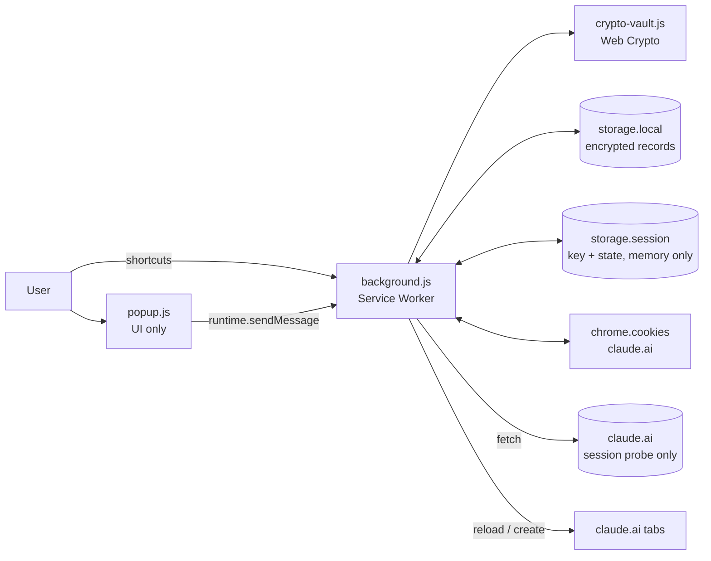
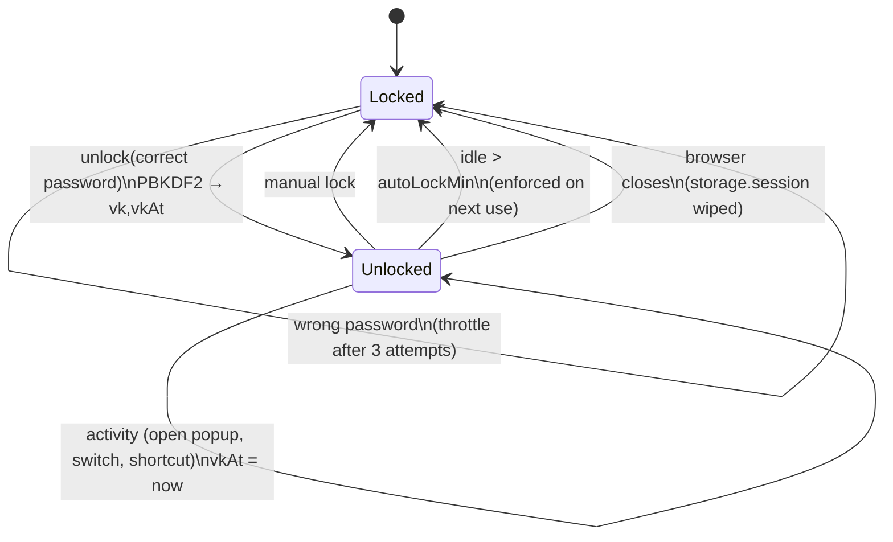
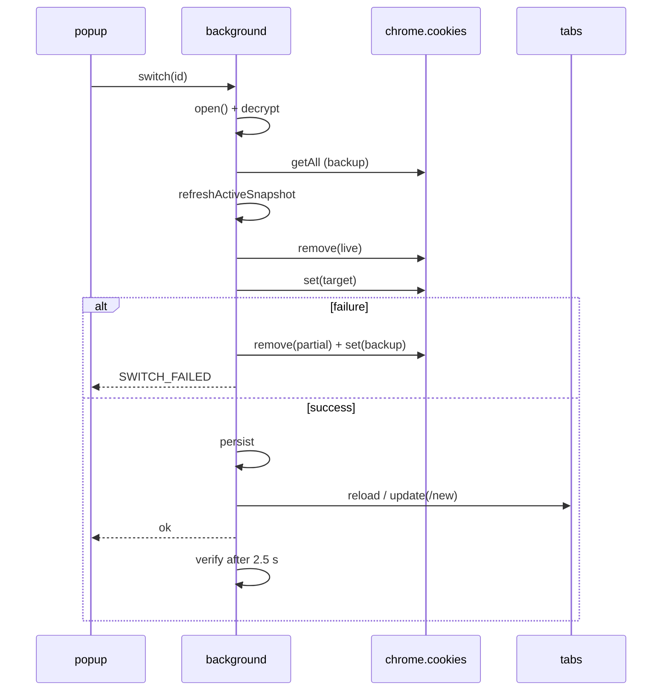
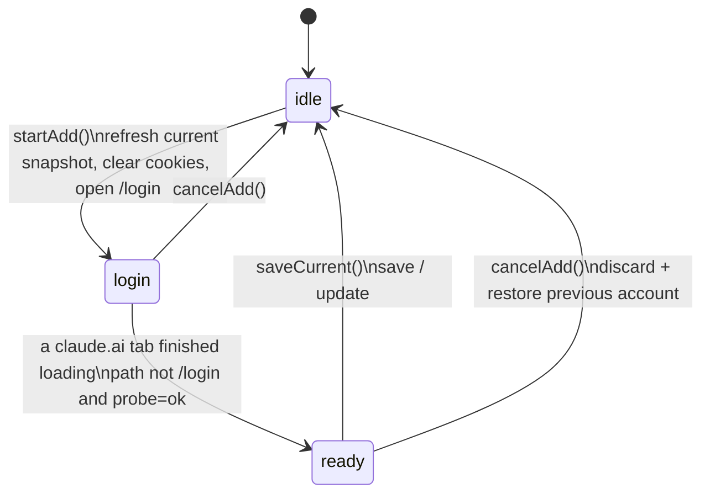

# Hopper — Account Switcher for claude.ai (Unofficial)
## Engineering and Academic Documentation — Version 1.2.0

> **Disclaimer:** Unofficial project. Not affiliated with, endorsed by, or sponsored by Anthropic. The name "claude.ai" appears only to describe the website the extension operates on. Use it only with accounts you own. Do not use it to share accounts or to bypass usage limits.
>
> **Verification status:** The extension has not undergone an independent security review. The analysis below is the author's own and is not a formal proof or certification.

---

## Table of Contents

1. [Abstract](#1-abstract)
2. [Introduction and Problem Statement](#2-introduction-and-problem-statement)
3. [Goals and Non-Goals](#3-goals-and-non-goals)
4. [Technical Background](#4-technical-background)
5. [Architecture](#5-architecture)
6. [Data Model](#6-data-model)
7. [Cryptographic Design](#7-cryptographic-design)
8. [Algorithms](#8-algorithms)
9. [Threat Model and Security Analysis](#9-threat-model-and-security-analysis)
10. [Privacy and Permission Minimization](#10-privacy-and-permission-minimization)
11. [Error Handling](#11-error-handling)
12. [UI, Internationalization and Accessibility](#12-ui-internationalization-and-accessibility)
13. [Verification and Testing](#13-verification-and-testing)
14. [Limitations and Future Work](#14-limitations-and-future-work)
15. [Legal and Compliance Considerations](#15-legal-and-compliance-considerations)
16. [Repository Layout, Installation and Development](#16-repository-layout-installation-and-development)
17. [References](#17-references)

---

## 1. Abstract

This document describes the design of Hopper, a Manifest V3 extension for Chromium browsers (Chrome and Edge) that lets a user switch between several claude.ai accounts they own in one click, without logging out and in. The approach is to capture a **snapshot** of each account's session cookies, store it **encrypted** on the local device, and, on demand, replace the browser's live cookies with the target account's snapshot and reload the affected tabs.

Key engineering properties:

- No third-party libraries and no build step (vanilla JavaScript, ES modules).
- AES-256-GCM encryption of both cookies and account metadata (name, email, color), under a key derived from a mandatory master password using PBKDF2-HMAC-SHA256 with 600,000 iterations. Every record is bound to its account identifier through AES-GCM additional authenticated data (AAD).
- Automatic locking with a **sliding idle window**, which reduces password prompts without leaving the key available indefinitely.
- Switching with **rollback** on failure, duplicate-account prevention, and expired-session detection.
- Minimal permissions: `cookies`, `storage`, and the host permission `https://claude.ai/*`. No `tabs`, no `<all_urls>`, no remote code.
- Network traffic only to `claude.ai` itself. No analytics, telemetry, or advertising.

---

## 2. Introduction and Problem Statement

Many users hold several accounts (personal, work, team). Conventional switching requires logging out and back in, sometimes with two-factor prompts or e-mail links, which is slow and repetitive. Common alternatives:

| Alternative | Advantage | Drawback |
|---|---|---|
| Browser profiles | Full isolation; no extension stores cookies | Heavier switching (separate window/profile), more resources |
| Incognito windows | Temporary isolation | Session lost on close |
| Containers | Excellent isolation | Not available in Chromium |
| **Cookie swapping (this project)** | Fast and convenient inside one profile | Stores secrets as sensitive as passwords; needs strong protection |

The central engineering problem: **how can an extension retain multiple reusable sessions without creating a weakly protected vault of high-value secrets?** A session cookie stands in for credentials after authentication; whoever obtains it may bypass the password and second factor while the session is valid. Effort is therefore concentrated on encryption, key management, and the key's lifecycle.

---

## 3. Goals and Non-Goals

### 3.1 Goals

| # | Goal |
|---|---|
| G1 | One-click or keyboard-shortcut switching between the user's accounts |
| G2 | Confidentiality of stored data at rest against reading the browser profile files |
| G3 | Record integrity and non-transferability of records between accounts |
| G4 | Do not lose the current session if a switch fails (rollback) |
| G5 | Minimal permissions and attack surface |
| G6 | Privacy: no data leaves the device |
| G7 | Arabic (RTL) and English support; automatic light/dark theme |
| G8 | Low annoyance: password entered once per browser start, subject to the idle timeout |

### 3.2 Non-Goals

- **Protecting the currently active account** from malware running with the user's OS privileges. That is an ordinary browser session outside any extension's control.
- Sharing accounts between people, bypassing usage limits, or any automation that violates the service's terms.
- Support for Incognito or for sites other than claude.ai.
- Cross-device synchronization (deliberate: `chrome.storage.sync` is never used).
- Recovery of a forgotten master password (there is no recovery mechanism by design).

---

## 4. Technical Background

### 4.1 Cookie-Based Sessions

Websites typically keep authentication state in cookies (see RFC 6265). Properties that shape the design:

- **`HttpOnly`**: not readable from page scripts, but readable by an extension through `chrome.cookies` (with host permission).
- **`Secure`**: sent over HTTPS only.
- **`SameSite`**: controls whether the cookie is sent on cross-site requests (`lax`, `strict`, `no_restriction`).
- **`hostOnly`**: a cookie without a Domain attribute belongs to that exact host. When re-creating it, **`domain` must not be passed**; otherwise it becomes a domain cookie.
- **`__Host-` / `__Secure-` prefixes**: impose constraints (path `/`, Secure, and no Domain for `__Host-`).
- **Expiry**: persistent (has `expirationDate`) or session cookie (dies with the browser).

> Consequently, the extension does not assume specific cookie names. It captures **all** cookies of the host `claude.ai` with their full attributes.

### 4.2 Manifest V3 and the Service Worker

- The background context is a **non-persistent** service worker: it is terminated after idling and restarted when an event arrives. In-memory variables therefore cannot carry state; state lives in `chrome.storage`.
- `chrome.storage.session` is **memory only**, cleared when the browser closes, and by default accessible only to trusted contexts (extension pages), not content scripts. The extension uses it to hold the unlocked key, the add-account flow state, and failed-unlock counters.
- Extension CSP: `script-src 'self'; object-src 'self'; base-uri 'none'`. No inline or remote code.

---

## 5. Architecture

### 5.1 Components

| File | Role |
|---|---|
| `manifest.json` | Permissions, shortcuts, CSP, icons, default locale |
| `background.js` | Service worker: cookies, storage, cryptography orchestration, switching, flows, badge, shortcuts |
| `crypto-vault.js` | Web Crypto operations (key derivation, AES-GCM encrypt/decrypt, SHA-256, legacy device key) |
| `popup.html/css/js` | User interface; holds no secrets and only sends messages to the background |
| `_locales/{en,ar}` | 83 message keys per language (`chrome.i18n`) |
| `tests/background.test.mjs` | Background-logic tests with mocked browser APIs |

### 5.2 Component and Data-Flow Diagram



### 5.3 Messaging Channel

The UI talks to the background with messages `{type, ...payload}` and receives `{ok, data}` or `{ok:false, error:{code}}`. The background verifies `sender.id === chrome.runtime.id` and ignores any other sender. Message types:

`status`, `setup`, `unlock`, `lock`, `setPassword`, `setAutoLock`, `setRemember`, `deleteAll`, `detect`, `saveCurrent`, `startAdd`, `cancelAdd`, `switch`, `refreshActive`, `rename`, `setColor`, `remove`.

### 5.4 Concurrency Model

State-mutating operations pass through a **serial queue** built on a promise chain:

```js
let queue = Promise.resolve();
function serial(fn) { const run = queue.then(fn); queue = run.catch(() => {}); return run; }
```

- Purpose: prevent a cookie swap from interleaving with storage writes or with another swap (race conditions).
- `status` is read-only and bypasses the queue.
- The queue is **not re-entrant**; internal operations call each other directly and never call `serial` again (otherwise a deadlock would occur).
- Note: the `tabs.onUpdated` listener writes the `pending` flow state to `storage.session` outside the queue. The conflict window is small because it writes a single key that other operations only ever replace wholesale.

---

## 6. Data Model

### 6.1 `chrome.storage.local["state"]` (persistent)

```jsonc
{
  "v": 2,
  "setupDone": true,
  "vault": { "mode": "password", "salt": "<b64 16B>", "iter": 600000,
             "verifier": { "v": 2, "iv": "<b64 12B>", "ct": "<b64>" } },
  "settings": { "autoLockMin": 240, "remember": false },          // minutes: 15 | 60 | 240 | 1440 | 4320 | 10080 | 0 (0 = until the browser closes)
  "activeId": "<uuid> | null",
  "accounts": [
    { "id": "<uuid>",
      "meta": { "v": 2, "iv": "...", "ct": "..." },   // encrypted: name,color,email,sfp,createdAt,lastUsed,status
      "blob": { "v": 2, "iv": "...", "ct": "..." } }  // encrypted: array of cookies
  ]
}
```

Unencrypted fields: `v`, `setupDone`, `vault.salt/iter/verifier` (the verifier is ciphertext), `settings`, `activeId` (a random identifier with no meaning), and each account's `id`. No name, email, or cookie value is stored in plaintext.

### 6.1b Optional key `chrome.storage.local["remember"]`

Present only while "Stay unlocked after restarting the browser" is active: `{ wrapped, lastActive }`, where `wrapped` is the raw unlock key encrypted (AES-GCM, AAD `remember`) under the **non-extractable device key** held in IndexedDB, and `lastActive` is the last-use timestamp. It lives under its own key (not inside `state`) so that frequent activity updates cannot race with state writes.

### 6.2 `chrome.storage.session` (memory only)

| Key | Content |
|---|---|
| `vk` | The unlocked key (raw AES-256, Base64) |
| `vkAt` | Time of last activity (idle timer) |
| `pending` | Add-account flow state `{phase, tabId, previousId, identity}` |
| `unlockFail` | `{n, until}` for throttling wrong attempts |

### 6.3 Serialized Cookie Entry

Per cookie: `name, value, domain, hostOnly, path, secure, httpOnly, sameSite, session`, and `expirationDate` (unless it is a session cookie). `storeId` is not saved (the default store is used) and neither is `partitionKey`.

### 6.4 Hydrated In-Memory State

On any operation, each account's `meta` is decrypted into a plain object `{id,name,color,...,blob}`, and written back through `persist()`, which re-encrypts every `meta` with a fresh IV. With a limit of 20 accounts, the cost (up to 20 AES-GCM decryptions per operation) is negligible in practice.

---

## 7. Cryptographic Design

### 7.1 Parameters

| Element | Choice |
|---|---|
| Key derivation | PBKDF2-HMAC-SHA256, **600,000** iterations, random 16-byte salt |
| Encryption | AES-256-GCM via the Web Crypto API |
| IV | Random 96-bit value for every encryption (`crypto.getRandomValues`) |
| AAD | Binds a record to its owner: `<id>:cookies`, `<id>:meta`, `verifier` |
| Password check | **Verifier**: encryption of `{ok:true}` under the derived key; successful decryption means the password is correct |
| Password retention | Never stored; only the salt, iteration count, and verifier are stored |

**Rationale.** The iteration count matches current OWASP guidance for PBKDF2-HMAC-SHA256. A random 96-bit IV with GCM is acceptable within NIST SP 800-38D limits as long as the number of encryptions under one key stays very small (here: tens to hundreds). One key serves multiple records; separation between records is enforced through AAD rather than through separate keys.

### 7.2 Binding Records to Owners (AAD)

Without AAD, someone who can edit storage could swap account A's `blob` with account B's `blob`, which would decrypt successfully and be attributed to the wrong account. With AAD = `<id>:cookies`, decryption fails after a swap and the operation is rejected with `CORRUPT`. The tests cover this case.

> **Important limit:** AAD does not prevent **rollback of the entire state to an older valid copy**, because the design has no monotonic counter. Replacing the state file with an older valid one would not be detected.

### 7.3 Key Lifecycle and Lock State Machine



**Behaviors that matter:**

- **Sliding idle window:** every real use (`status` when the popup opens, `switch`, `saveCurrent`, shortcuts, and so on) renews `vkAt`. Silent background work (post-switch verification `opVerify` and the toolbar badge refresh) runs with `touch:false` and therefore does not extend the session on its own.
- **Lazy enforcement:** there is no background timer (this avoids requesting the `alarms` permission). On the first use after the timeout, the key is deleted and `LOCKED` is returned. In other words, the key may remain in browser memory (not on disk) until the first access after the timeout. This is a deliberate trade-off between minimal permissions and strict timing.
- **Timeout choices:** 15 minutes, 1 hour, 4 hours (default), 1 day, 3 days, 1 week, or "until the browser closes" (value 0: no idle lock). All windows are sliding, so regular use keeps the extension unlocked. **They apply only while the browser process keeps running:** the key lives in `storage.session`, which is wiped when the browser quits completely, so a full restart always requires the password. Longer windows also keep the key in memory longer, which widens the exposure described in Section 9.4.
- **Throttling:** after 3 failures, `delay = min(2^(n-3) seconds, 60 seconds)`; reset on success. The counter lives in `storage.session`, so it resets when the browser restarts. The purpose is protection against someone at an open browser; protection against offline guessing comes from PBKDF2 cost and password strength.
- **Key export:** the derived key is extractable (`extractable=true`) so that it can be saved in raw form in `storage.session`. This is intentional: the service worker is terminated and restarted, and a `CryptoKey` object cannot be kept alive across those cycles.

#### Optional persistence across restarts ("remember")

Because `storage.session` is wiped when the browser quits, the idle windows alone cannot keep the extension unlocked across a full restart. An **opt-in** setting (off by default, with a confirmation dialog) stores a wrapped copy of the unlock key in `storage.local`:

- **Restore:** if the session key is missing and `remember` is on, `getKey` unwraps the stored copy with the device key and repopulates `storage.session`, but **only if** `now - lastActive` is within the idle window. Otherwise the copy is deleted and `LOCKED` is returned.
- **Bounded exposure:** the window is mandatory. "Until the browser closes" (value 0) is rejected while remembering, and enabling the option converts 0 to 1 week.
- **Clearing:** a manual Lock, an idle expiry, a failed unwrap, turning the option off, or *Delete all data* removes the copy. A successful password unlock re-creates it while the option is on.
- **Security consequence:** the device key and the wrapped key sit in the same browser profile, so anyone who copies the profile can unwrap the key and open the accounts **without the password** until the window elapses. This is equivalent in strength to the v1.0 device-key mode, but time-limited and opt-in. It is why the option is off by default.

### 7.4 Legacy Mode and Data Migration

Version 1.0 allowed operation without a password, using a **non-extractable** device key stored in IndexedDB, with plaintext metadata. From 1.1.0, a password is mandatory. When `vault.mode !== 'password'` is detected:

1. The UI shows a "Security upgrade" screen and blocks other actions (`NOT_SETUP`).
2. `opSetPassword` decrypts using the device key, accepts legacy data (no `v:2`, no AAD, plaintext metadata), then re-encrypts **everything** under the password-derived key in a **single write** (`persist`). The old data therefore stays valid until the write succeeds.
3. `v:1` records remain readable (backward compatible) and are upgraded the first time they are re-encrypted.

---

## 8. Algorithms

### 8.1 Save

```
SAVE_CURRENT():
  (S,K) ← open()
  probe ← probeSession()                       // check against claude.ai
  if probe = anon → NOT_LOGGED_IN
  C ← serialize(liveCookies())                 // all claude.ai cookies
  if C = ∅ → NOT_LOGGED_IN
  sfp ← fingerprint(C)
  m ← findMatch(S, probe.email, sfp)           // duplicate prevention
  if m ≠ ⊥ → m.blob ← Enc_K(C; aad=m.id‖":cookies"); m.status ← ok
  else      → create a new account (id=UUID, name from probe or "Account N", unused color)
  S.active ← id; persist(S,K); pending ← ⊥
```

### 8.2 Switch with Rollback

```
SWITCH(id):
  (S,K) ← open()                               // unlock + decrypt metadata + renew timer
  T ← S.accounts[id];     if T = ⊥  → NOT_FOUND
  if S.active = id → return
  C_T ← Dec_K(T.blob; aad=id‖":cookies")       // failure → CORRUPT
  if ¬usable(C_T) → T.status ← expired; EXPIRED
  C_0 ← serialize(liveCookies())               // backup for rollback
  if S.active ≠ ⊥ → refreshActiveSnapshot(S.active, C_0)
  remove(C_0)
  try   apply(C_T)
  catch → remove(live); try apply(C_0); SWITCH_FAILED
  S.active ← id; T.lastUsed ← now; persist(S,K)
  reloadTabs(); schedule verify(id) after 2.5 s
```

**Design notes:**

1. **Refresh the departing account's snapshot first:** the server may rotate session tokens; if the snapshot were not refreshed it would go stale.
2. **Guard against wrong overwrites:** `refreshActiveSnapshot` skips the update when the live session is dead (`anon`) or its e-mail differs from the active account's (the user switched manually).
3. **Atomicity:** the cookies API offers no true atomicity. Rollback is best effort: if the rollback itself fails, exceptions are swallowed and the user is left with an incomplete session. Also, the refreshed snapshot is held only in memory and committed only on success.
4. **Applying a cookie:** expired cookies are skipped; `domain` is passed only for domain cookies (`hostOnly=false`); the URL is derived from host and path.
5. **Reload:** all claude.ai tabs are refreshed (cookies are shared across the profile). If the path is `/chat/...` or `/project(s)/...`, the tab is sent to `/new`, since another account's conversation would return 404. If no tab exists, one is opened.



### 8.3 Add-Account Flow



- The `pending` state is kept in `storage.session`. When **any** claude.ai tab finishes loading (not a specific tab, to support e-mail links and OAuth flows that open another tab) and the path does not start with `/login`, `probeSession` runs; if it succeeds the state becomes `ready` and a green `+` badge appears.
- The current tab is reused if it is on claude.ai; otherwise a new tab is opened (the user's unrelated site is never navigated away).
- On cancel, the previous account is restored through `switch`.
- **Detection on popup open (`detect`):** if a live session matches a saved account, it is adopted as the active account and its snapshot is refreshed; if it matches none, "Save this account?" is shown.

#### One-click re-login of an existing account

`startAdd({ reloginId })` runs the same flow as adding an account, but remembers which account is being refreshed (`pending.reloginId`). When a claude.ai tab finishes loading and the probe succeeds, `opAutoRelogin` runs automatically:

- If the signed-in identity matches the target account (same e-mail, or either side has no e-mail), the live cookies replace that account's snapshot, its status becomes `ok`, it becomes the active account, and the flow ends with no extra prompt. The user's explicit "Sign in again" click is treated as consent.
- If a **different** account signed in, nothing is overwritten; the normal "Save this account?" / "Update saved account?" banner appears instead.
- If the vault became locked in the meantime, the flow stays in `ready` and the banner handles it after unlocking.
- The same path is used when "Refresh session" finds the live session dead (`NOT_LOGGED_IN`): the UI starts the re-login flow directly.

### 8.4 Identity Detection and Duplicate Prevention

- `probeSession()` requests `/api/account`, then `/api/bootstrap`, from `claude.ai` using the current cookies (via host permission). **These endpoints are not officially documented and may change.** Result: `ok` (with e-mail/name if present), `anon` (401, or 403 with a JSON body), or `unknown` (network failure or unexpected content, for example a Cloudflare challenge page).
- Duplicate recognition: e-mail match (case-insensitive) **or** a match on the **session fingerprint (sfp)**.
- `sfp` = the first 32 hex characters of `SHA-256("name=value")` of the most session-like HttpOnly cookie (name matches `/session/i`, otherwise the one with the latest expiry). The raw value is not stored.
- **Limitation:** if the server rotates the token, `sfp` changes, which weakens detection when no e-mail is available; e-mail is therefore the primary identifier.

### 8.5 "Session Expired" State

A session is marked `expired` in two cases: (1) all cookies in the snapshot are expired by timestamp, or (2) about 2.5 seconds after a switch, the probe returns `anon`. The UI offers "Sign in again" (which starts the add flow). Expired accounts are skipped when cycling by shortcut.

---

## 9. Threat Model and Security Analysis

### 9.1 Assets

| Asset | Sensitivity |
|---|---|
| Saved session cookies | Very high (equivalent to credentials) |
| Metadata (name/email) | Medium (privacy) |
| Unlocked key in memory | Very high (decrypts everything) |
| Master password | Very high |
| Live cookies of the active account | High (outside the protection scope) |

### 9.2 Adversaries and Mitigations

| Adversary | Capability | Mitigation | Residual risk |
|---|---|---|---|
| **A1** Reads profile files (stolen device / backup) | Reads `storage.local` | AES-GCM under a PBKDF2-derived key | Depends on password strength; **voided while "remember" is on and not idle-expired** |
| **A2** Malware with the user's OS privileges | Runs code, reads memory, steals live browser cookies | No complete mitigation | **Out of scope**: can read live cookies and the session key from memory |
| **A3** Another malicious extension | Access to `cookies` if it holds the permission | Extension isolation; no content scripts; `storage.session` limited to trusted contexts | An extension with `cookies` on claude.ai can already read the live session |
| **A4** Network attacker | Intercepts traffic | Requests only to claude.ai over HTTPS | None added |
| **A5** Person at an open browser | Uses the UI | Auto-lock, manual lock, attempt throttling | Open until the timeout passes |
| **A6** Supply chain (malicious update / compromised developer account) | Ships malicious code to all users | No third-party libraries, small auditable code, 2FA on the developer account, open-source release | **Highest-impact risk**; mitigation is procedural, not technical |
| **A7** Injection (XSS) in the popup | Script execution in extension context | DOM built with `textContent`, no `innerHTML`; strict CSP | Low |
| **A8** Server-side detection or restriction | Ends sessions or requests re-verification | Cannot be mitigated technically here | Unknown; consult the terms of service |
| **A9** Tampering with the state file | Swaps records | GCM + AAD | Replacement with an older valid copy is undetected |

### 9.3 Claimed Security Properties

- **Confidentiality of stored records** while locked (given a strong password) against A1.
- **Per-record integrity and binding to the owner** (processing fails if a record's content is altered or two records are swapped).
- **No cookie values in logs**: only the error code is printed.
- **No connections other than claude.ai.**

### 9.4 Known Residual Risks

1. The unlocked key sits in `storage.session` in raw form and may persist after the timeout until the first access (lazy enforcement).
2. No explicit wiping of secrets from JavaScript memory (a managed runtime offers no zeroization guarantee).
3. Cookies are in plaintext in memory during a switch.
4. No protection against replacing the whole state file with an older valid copy.
5. Throttling does not stop offline guessing; protection there depends on password strength.
6. No password recovery; forgetting it means deleting the data.
7. Reliance on undocumented endpoints (`/api/account`) for identity detection.
8. With "remember" enabled, the password no longer protects against profile-file copying until the idle window elapses (see Section 7.3).

---

## 10. Privacy and Permission Minimization

### 10.1 Permissions

| Permission | Why it is requested |
|---|---|
| `cookies` | Read, save, remove, and restore session cookies of the user's own accounts; the core of the switching mechanism |
| `storage` | Keep encrypted snapshots and settings in `local`, and the temporary key in `session` |
| `https://claude.ai/*` | Access the site's cookies and query session validity and account name/email |

**Not requested:** `tabs` (the host permission suffices to read `url` of claude.ai tabs and to create, update, and reload tabs), `<all_urls>`, `alarms`, `scripting`, and no remote code. Dropping `tabs` also removes the "Read your browsing history" warning from the install dialog.

### 10.2 Data Policy

- Everything stays in `chrome.storage.local`. `chrome.storage.sync` is **never** used (the tests throw an error on any call to it).
- No network except `claude.ai`. No analytics, telemetry, or ads.
- **Delete all data** in Settings clears `storage.local`, `storage.session`, and the legacy device key (IndexedDB). It does not sign you out of claude.ai.
- Full details in `PRIVACY.md`.

---

## 11. Error Handling

The background returns **stable codes** (not text); the UI translates them through `chrome.i18n` using the key `err_<CODE>`. Only the error code is logged, to avoid any value leakage.

| Code | Meaning |
|---|---|
| `LOCKED` | Locked (manually, by idle, or after browser start) |
| `NOT_SETUP` | Setup incomplete, or a password must be set (upgrade) |
| `NOT_FOUND` | Account does not exist |
| `EXPIRED` | The account's snapshot has expired |
| `SWITCH_FAILED` | Setting cookies failed; rollback was performed |
| `NOT_LOGGED_IN` | No valid session on claude.ai |
| `BAD_PASSWORD` | Wrong password |
| `WEAK_PASSWORD` | Fewer than 8 characters |
| `PW_MISMATCH` | The two password fields differ (detected in the UI) |
| `MISMATCH` | The live account differs from the account being updated |
| `CORRUPT` | A record could not be decrypted (corruption or tampering) |
| `TOO_MANY` | Too many unlock attempts; wait |
| `GENERIC` | Generic error |

---

## 12. UI, Internationalization and Accessibility

- **Layout:** 340×440 px popup. A horizontal chip bar (circle with initial and color; ring around the active one; warning dot for expired) with a `+` chip at the end; below it a detail card (name, email, last used, status, and buttons: Rename, Color, Refresh session / Sign in again, Remove). Clicking a chip switches immediately; right-clicking shows details without switching.
- **Internationalization:** `chrome.i18n` with `_locales/en` and `_locales/ar` (83 keys). The language follows the browser UI language (there is no in-extension switcher). Direction comes from `@@bidi_dir`.
- **RTL:** styles use **logical properties** (`margin-inline`, `inset-inline-end`, and so on), so the layout mirrors automatically.
- **Theme:** automatic light/dark via `prefers-color-scheme`, and reduced motion via `prefers-reduced-motion`.
- **Rendering safety:** DOM is constructed manually with `textContent` only; no `innerHTML` anywhere (account names are user data).
- **Accessibility:** real `button` elements with `aria-label` and `aria-pressed`, visible focus outline, and `aria-live` announcements for messages.
- **Shortcuts:** `Alt+Shift+A` (open), `Alt+Shift+→` and `Alt+Shift+←` (cycle). Change them at `chrome://extensions/shortcuts`. The toolbar badge briefly shows the account initial after a switch, a red `!` on failure or lock, and a green `+` when ready to save.

---

## 13. Verification and Testing

### 13.1 Automated Tests

`tests/background.test.mjs` runs the real `background.js` against **mocks** of `chrome.storage`, `chrome.cookies`, `chrome.tabs`, `fetch`, and `IndexedDB`. It verifies **25 checks**:

| # | Check |
|---|---|
| 1 | Password is mandatory (weak and empty rejected) |
| 2 | Saving an account |
| 3 | Names, emails, and cookies are **encrypted** in storage (no plaintext) |
| 4 | Add-account flow and `pending` state |
| 5 | Switching restores cookies with their attributes (including `hostOnly`) |
| 6 | A failed switch rolls cookies back |
| 7 | The same account is not saved twice |
| 8 | Rename works and remains encrypted |
| 9 | Idle auto-lock |
| 10 | Throttling after 3 wrong attempts |
| 11 | Unlock after the wait |
| 12 | Activity renews the timer (sliding) |
| 13 | "Until the browser closes" never idle-locks |
| 14 | Swapping two records in storage is detected (AAD) |
| 15 | Changing the password re-encrypts and keeps accounts usable |
| 16 | Upgrade of 1.0 data (device key + plaintext metadata + no AAD) |
| 17 | Long idle windows (1 day, 3 days, 1 week) lock only after their own limit; invalid values are rejected |
| 18 | Delete all data |
| 19 | One-click re-login updates the same account automatically |
| 20 | Signing in as a different account during re-login is not auto-saved |
| 21 | Remembered key survives a simulated browser restart and is not stored in the clear |
| 22 | Remembered key expires after the idle window, even across restarts |
| 23 | Manual lock clears the remembered key |
| 24 | "Until the browser closes" is rejected while remembering |
| 25 | Turning remember off requires the password after restart |

Run (copy `background.js` and `crypto-vault.js` next to the test file, or adjust the import path):

```bash
node tests/background.test.mjs
```

### 13.2 What the Tests Do Not Cover

- **Real claude.ai behavior:** session binding to factors beyond cookies, Cloudflare protection, and changes to `/api/...` endpoints.
- **Real Chrome cookie semantics:** enforcement of `SameSite`, `__Host-`, partitioned cookies, and exact `remove/set` behavior.
- **User interface (DOM)**, visual experience, and RTL.
- **Actual service worker lifecycle** (termination and restart).
- **Independent security review.**

### 13.3 Manual Test Plan

1. Load the extension (Load unpacked), set a password, and save two real accounts.
2. Switch repeatedly (click and shortcuts); confirm you are signed in as the right account after reload.
3. Edge cases: browser restart (password prompt), manual lock, expired session, removing an account, changing the password, changing the lock timeout.
4. **Upgrade from 1.0:** load 1.1.0 over 1.0 and confirm accounts survive.
5. Network audit in the service worker console: no requests other than `claude.ai`.
6. Storage audit: `chrome.storage.local.get(null)` shows no names, emails, or cookie values, and `chrome.storage.sync.get(null)` returns `{}`.
7. Arabic and English, light and dark.

---

## 14. Limitations and Future Work

### 14.1 Limitations

- Not tested against real claude.ai within this document; real-world test results rest with the user.
- Partitioned cookies (CHIPS) are unsupported; if the site relies on them in the future, switching as designed will not work.
- All claude.ai tabs switch together (cookies are shared); unsent text in an open conversation may be lost.
- Google sign-in and e-mail-link sign-in may not be detected automatically in the `+` flow; opening the popup afterward picks up the session.
- No multi-profile and no Incognito support.
- Signing out on the site itself invalidates the session on the server, leaving the saved snapshot dead; switching through the extension is always recommended.

### 14.2 Proposed Future Work

| Proposal | Benefit | Cost |
|---|---|---|
| Monotonic counter against state rollback | Closes whole-state rollback | Complexity, and a trusted store outside storage |
| Non-extractable key with re-derivation on each worker start | Shorter key exposure | Password re-prompt after every worker termination (hurts UX) |
| `chrome.alarms` for a precise lock timer | Exact timeout enforcement | Extra permission |
| Argon2id (WASM) instead of PBKDF2 | Better GPU-guessing resistance | External library (violates the zero-dependency rule) |
| WebAuthn unlock | Higher convenience | Large complexity, marginal benefit here |
| End-to-end tests with a real browser (Puppeteer/Playwright) and the extension loaded | Coverage of real semantics | Test environment and accounts |

---

## 15. Legal and Compliance Considerations

- **Branding:** a neutral name (Hopper) and an icon not derived from any brand; the description states explicitly: "Unofficial. Not affiliated with Anthropic."
- **Terms of service:** a disclaimer in the description does not replace reading the service's terms of use. Responsibility rests with the user and the publisher. The author cannot state how the service treats cookie reuse or rapid account switching.
- **Chrome Web Store:** a clear single purpose (switching between the user's own accounts), a justification for each permission, a disclosure of "authentication information" handled locally only, a public privacy policy (`PRIVACY.md`), and no remote code. Extensions that handle cookies receive closer review and may take longer.
- **License:** MIT.

---

## 16. Repository Layout, Installation and Development

```
hopper/
├─ manifest.json
├─ background.js             # core logic
├─ crypto-vault.js           # Web Crypto
├─ popup.html / popup.css / popup.js
├─ _locales/en|ar/messages.json
├─ icons/icon16|32|48|128.png
├─ tests/background.test.mjs
├─ tools/make_icons.py       # icon generation (Pillow)
├─ docs/store-listing.md, docs/SUBMISSION-CHECKLIST.md
├─ README.md, PRIVACY.md, CHANGELOG.md, LICENSE, .gitignore
```

**Development install:** `chrome://extensions` → enable Developer mode → Load unpacked → choose the folder containing `manifest.json`. There is no build step: edit files, then reload the extension. To inspect background errors, open the service worker console from the extension card.

**Packaging for publication:**

```bash
zip -r ../hopper-1.2.0.zip manifest.json background.js crypto-vault.js \
    popup.html popup.css popup.js _locales icons
```

**Contribution guidelines:** keep permissions minimal, add no network destinations, never log cookie values, add a test for any change to background logic, and keep the key sets of both languages identical.

---

## 17. References

1. A. Barth, *HTTP State Management Mechanism*, RFC 6265, IETF, 2011.
2. K. Moriarty, B. Kaliski, A. Rusch, *PKCS #5: Password-Based Cryptography Specification Version 2.1*, RFC 8018, IETF, 2017.
3. M. Dworkin, *Recommendation for Block Cipher Modes of Operation: Galois/Counter Mode (GCM) and GMAC*, NIST SP 800-38D, 2007.
4. W3C, *Web Cryptography API* (Recommendation).
5. OWASP, *Password Storage Cheat Sheet* (PBKDF2 parameter guidance).
6. Google Chrome Developers, *Extensions — Manifest V3: service workers, `chrome.cookies`, `chrome.storage`, `chrome.i18n`, `chrome.commands`*.
7. Chrome Web Store, *Program Policies*, including the *Limited Use* and *Single Purpose* requirements.

---

*Last updated: 2026-10-05 — Version 1.2.0.*
